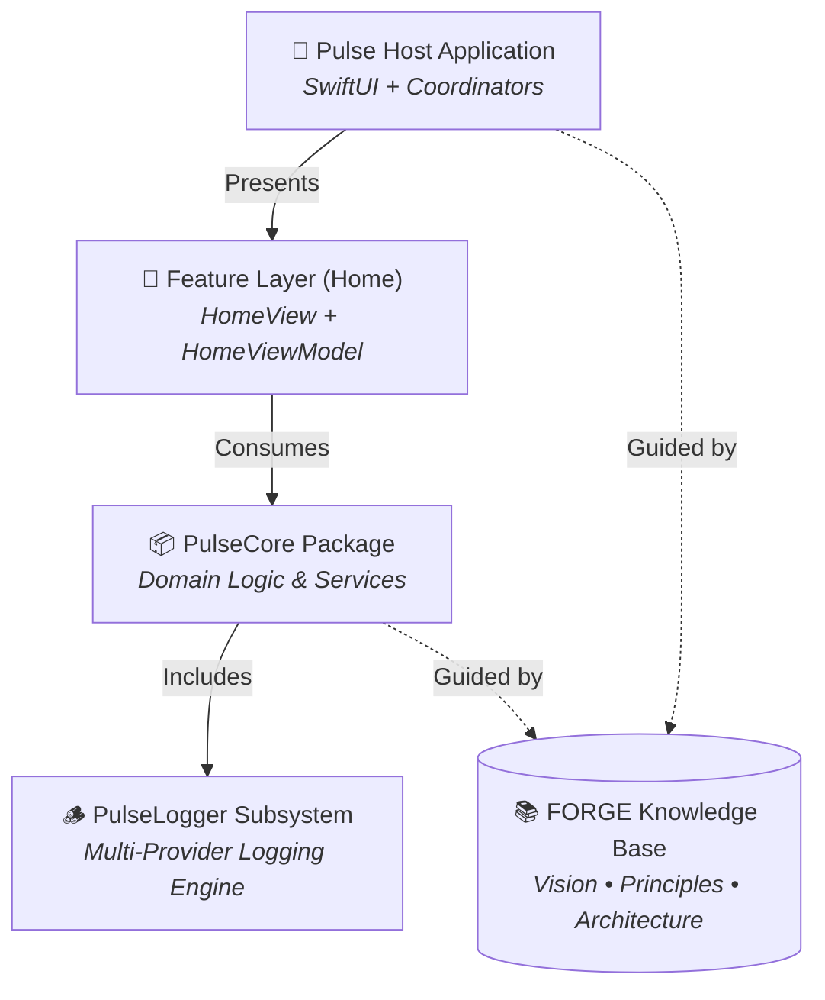

# Pulse

[](https://swift.org)
[](https://developer.apple.com/swift/)
[](#architecture-overview)
[](#the-forge-framework)
[](LICENSE)

**Pulse** is a modular engineering ecosystem and reference implementation for building production-grade Swift applications. Designed from the ground up for scalable architecture, strict isolation of concerns, and deterministic human-AI collaboration, Pulse demonstrates how to build maintainable, high-velocity software without sacrificing quality or architectural integrity.

---

## 📖 Table of Contents

- [Vision & Purpose](#-vision--purpose)
- [Architectural Pillars](#-architectural-pillars)
- [The FORGE Framework](#-the-forge-framework)
- [Packages & Capabilities](#-packages--capabilities)
  - [PulseCore](#pulsecore)
  - [PulseLogger Subsystem](#pulselogger-subsystem)
- [Getting Started](#-getting-started)
  - [Prerequisites](#prerequisites)
  - [Opening in Xcode](#opening-in-xcode)
  - [Running Unit Tests](#running-unit-tests)
- [Code Examples](#-code-examples)
- [Architectural Invariants](#-architectural-invariants)
- [License](#-license)

---

## 🎯 Vision & Purpose

As software scales, cognitive overload and architectural erosion become the primary bottlenecks to progress. While modern AI tooling can dramatically accelerate development, traditional large codebases suffer from **context collapse**—where AI loses focus when exposed to sprawling, tightly coupled code, resulting in degraded quality, hallucinations, and compounding technical debt.

Pulse serves as a living blueprint and proving ground that addresses these challenges through:

1. **Absolute Modularity**: Strict boundaries between presentation layers, standalone domain packages, and infrastructure.
2. **Constrained Context**: Hierarchical knowledge structuring via **FORGE** so both humans and AI reason with only the minimal, relevant context.
3. **Reference Standards**: Best-in-class Swift practices including modern Swift Concurrency, native SwiftUI declarative UI, Coordinator-based routing, and zero third-party dependency bloat.

---

## 🏛 Architectural Pillars

The Pulse host application is intentionally designed as a thin, disposable showcase layer consuming independent, reusable packages.



| Pillar | Decision | Rationale |
| :--- | :--- | :--- |
| **UI Framework** | **SwiftUI** | Declarative, reactive, state-driven interface minimizing boilerplate and maximizing clarity. |
| **Presentation Pattern** | **Strict MVVM** | Unidirectional data flow: `Coordinator` → `ViewModel` → `Services` → `State` → `View`. Views hold no business or formatting logic. |
| **Navigation** | **Coordinator Pattern** | Views never trigger direct navigation transitions. Coordinators own routing, lifecycle, and screen composition. |
| **Dependency Injection** | **Constructor Injection** | Explicit initializers over magic service locators or dynamic DI containers. Pure compile-time safety and painless test mocking. |
| **Concurrency** | **Swift Concurrency** | Native `async`/`await`, `Task`, and `actor` models. Full Swift 6 strict concurrency compliance with zero data races. |
| **Modularity** | **Package-First** | Domain and business logic live in isolated Swift packages (`PulseCore`), not in the application target. |

---

## 🔨 The FORGE Framework

Pulse is built using **FORGE** (*Framework for Organized Rapid Generative Engineering*).

FORGE solves AI context degradation by treating documentation as executable context:

- **Hierarchical Knowledge Organization**: Documentation is split into modular layers (`Vision`, `Principles`, `Architecture`, `Milestones`).
- **Context Routing**: AI agents navigate via `ROUTER.md` maps, pulling only the relevant sub-specifications for their active task rather than consuming the entire repository.
- **Documentation as Implementation**: Architectural decisions and operational procedures live alongside the code, preserving rationale and design integrity.

---

## 📦 Packages & Capabilities

### PulseCore
`PulseCore` is the foundational domain logic package. Completely decoupled from UI frameworks, it encapsulates business rules, services, data handling, and core utilities.

### PulseLogger Subsystem
A thread-safe, high-performance structured logging engine included in `PulseCore`:

- 🚀 **Multi-Provider Architecture**: Log concurrently to console, Apple `os.Logger`, or custom backend providers.
- ⚡ **Zero Overhead for Filtered Logs**: Uses Swift `@autoclosure` for lazy string evaluation, ensuring disabled log levels incur near-zero CPU cost.
- 🔒 **Thread-Safe by Design**: Synchronized concurrent access across multiple threads using modern Swift primitives.
- 🏷 **Rich Metadata & Scopes**: Type-safe metadata (`LogMetadataValue`), custom subsystem/category grouping, and file/line tracking.
- 🛡 **Extensible**: Easily implement the `LogProvider` protocol to route logs to external analytics or observability platforms.

---

## 🚀 Getting Started

### Prerequisites
- macOS 14.0 (Sonoma) or newer
- Xcode 16.0+ with Swift 6.0 toolchain

### Opening in Xcode
1. Clone the repository:
   ```bash
   git clone https://github.com/kishan-sadhwani/Pulse.git
   cd Pulse
   ```
2. Open the Xcode workspace/project:
   ```bash
   open Pulse.xcodeproj
   ```
3. Select an iOS simulator or connected device and press `Cmd + R` to run.

### Running Unit Tests
You can run the full test suite either via Xcode (`Cmd + U`) or through the command line with Swift Package Manager:

```bash
cd Pulse/PulseCore
swift test
```

---

## 💻 Code Examples

### Initializing & Using PulseLogger

```swift
import PulseCore

// 1. Configure Logger with desired log levels and providers
let config = PulseLoggerConfiguration(
    minimumLogLevel: .debug,
    providers: [
        ConsoleLogProvider(showTimestamps: true),
        OSLogProvider(subsystem: "com.pulse.app")
    ]
)

let logger = PulseLogger(configuration: config)

// 2. Structured logging with categories and metadata
logger.info(
    "User session initialized",
    category: .lifecycle,
    metadata: [
        "userId": .string("usr_98234"),
        "isPremium": .bool(true),
        "retryCount": .int(0)
    ]
)

// 3. Error logging with automatic file & line capture
do {
    try performOperation()
} catch {
    logger.error("Operation failed: \(error.localizedDescription)", category: .general)
}
```

### Implementing a Custom Log Provider

```swift
import PulseCore

final class CustomAnalyticsProvider: LogProvider {
    func log(
        level: LogLevel,
        message: String,
        category: LogCategory,
        metadata: [String: LogMetadataValue]?,
        file: String,
        function: String,
        line: UInt
    ) {
        guard level >= .warning else { return }
        // Dispatch to analytics / monitoring backend...
    }
}
```

---

## 📐 Architectural Invariants

Every contribution (human or AI) must strictly adhere to the following invariants:

1. **No Business Logic in Views**: Views only render state and forward user actions to ViewModels.
2. **No UI Imports in Domain/ViewModels**: ViewModels and domain models must never import UI frameworks.
3. **Explicit Dependencies**: No implicit singletons or ambient global state. All dependencies must be injected via constructors.
4. **Thin Host App**: Any capability that can be isolated and tested independently belongs inside a Swift package.
5. **One-Way Dependency Flow**: Dependencies flow strictly downward: `Host App` → `Packages` → `Knowledge Base`. Packages never depend on the host application.

---

## 📄 License

This project is licensed under the MIT License - see the [LICENSE](LICENSE) file for details.
